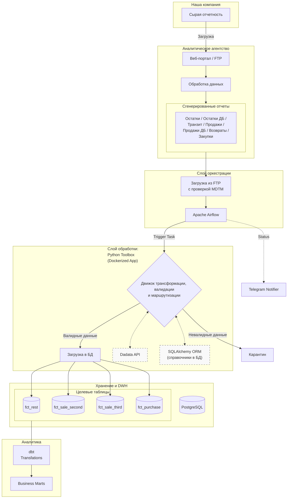

# Enterprise Data Platform: Analytic Pharma Integration

Система автоматизированной интеграции данных внешнего аналитического подрядчика в инфраструктуру компании: Airflow-оркестрация, умный сбор с FTP, кастомный движок валидации на Python и аналитическое моделирование в dbt.

---

## 📖 Предыстория проекта

Исходная ситуация в компании характеризовалась сбором отчетности от множества аптечных сетей и дистрибьюторов. Процесс обработки данных силами внутренних аналитиков имел ряд критических недостатков:

1.  **Высокая операционная нагрузка:** Аналитики тратили большую часть рабочего времени на рутинную очистку и загрузку файлов вместо проведения качественного анализа.
2.  **Отсутствие мастер-данных:** Из-за отсутствия глобального справочника аптек РФ было невозможно точно сопоставить "сырые" адреса из отчетов с конкретными точками продаж. Это приводило к невозможности оценки полной картины товарооборота (закупки -> продажи -> остатки) на уровне конечных аптек.
3.  **Риски качества данных:** Ручной ввод и отсутствие автоматизированных проверок повышали вероятность ошибок в DWH.

### Решение
Для решения этих проблем компания перешла на модель аутсорсинга обработки первичных данных через специализированное аналитическое агентство. Данный проект представляет собой **интеграционную платформу**, которая:
* Автоматизирует прием обработанных данных от агентства через FTP.
* Реализует **двухуровневый контроль качества**: мы не доверяем внешним данным на 100% и проверяем их собственным движком валидации.
* Автоматически выявляет специфические ошибки (неопределенные ID SKU, новые филиалы дистрибьюторов без справочников) и уведомляет ответственных лиц.
* Снимает рутинную нагрузку с аналитиков, позволяя им работать с уже очищенными и связанными данными.

 ---
 
## 🏗 Архитектура системы

---

## 🛠 Технологический стек

### Core Data Tools
* **Orchestration:** Apache Airflow 2.8 (TaskFlow API, Dynamic Task Mapping).
* **Data Processing:** Python 3.11, Pandas (Chunk processing), SQLAlchemy (ORM).
* **Transformation:** dbt - управление аналитическим слоем.
* **Database:** PostgreSQL — целевое хранилище (DWH).

### Infrastructure & Storage
* **Data Storage (Raw):** SMB Share - файловое хранилище для обмена данными с внешними системами.
* **Linux Admin:** Настроено монтирование сетевых ресурсов через системный демон (mount/cifs) для обеспечения бесперебойного доступа контейнеров к данным.
* **DevOps:** Docker (контейнеризация компонентов), Gitea (Self-hosted CI/CD пайплайны).

### Integrations & Monitoring
* **External API:** Dadata API - нормализация адресов, обогащение гео-данных, работа с ФИАС-кодами.
* **Observability:** Telegram API — мониторинг состояния конвейеров и алертинг об ошибках данных.

---

## 📊 Схема маршрутизации данных (Data Routing)

Система обрабатывает 7 типов входящих отчетов от поставщика, выполняя автоматический маппинг и нормализацию в 4 целевые таблицы DWH:

| Тип исходного файла | Целевая таблица (DWH) | Описание сущности |
| :--- | :--- | :--- |
| **ОСТАТКИ** | `fct_rest` | Остатки продукции в аптеках и складах аптечных сетей |
| **ОСТАТКИ ДБ** | `fct_rest` | Остатки продукции на складах дистрибьюторов |
| **ТРАНЗИТ ДБ** | `fct_rest` | Товары в пути до склада дистрибьютороа |
| **ПРОДАЖИ** | `fct_sale_third` | Продажи продукции в аптеках (третичные продажи) |
| **ПРОДАЖИ ДБ** | `fct_sale_second` | Продажи дистрибьюторов аптечным сетям (вторичные продажи) |
| **ВОЗВРАТЫ ДБ** | `fct_sale_second` | Возвраты продукции из аптечных сетей на склады дистрибьюторов |
| **ЗАКУПКИ** | `fct_purchase` | Данные о закупках продукции аптеками |

---

## 🌟 Ключевые особенности и функции

### 1. Smart Ingestion (Умный сбор)
* **Контроль метаданных:** Перед загрузкой система сверяет имя файла и его атрибут `mdtm` (Modification Time) с историей в БД. Если файл не менялся, загрузка пропускается, что экономит время  и вычислительные ресурсы.
* **Идемпотентность:** Реализован паттерн "Delete-Insert" — повторный запуск задачи за один и тот же период не создает дубликатов и поддерживает консистентность данных в DWH.

### 2. Custom Validation Engine (Toolbox)
Центральный компонент на Python, обеспечивающий качество данных:
* **Chunk Processing:** Потоковое чтение тяжелых CSV-файлов чанками. Система потребляет фиксированный объем оперативной памяти независимо от размера входного файла.
* **Config-driven logic:** Все правила трансформации, маппинга и валидации описаны в JSON-конфигах. Это позволяет изменять бизнес-логику обработки без необходимости переписывать Python-код.
* **Error Quarantine:** Невалидные строки автоматически отсеиваются в отдельные CSV-файлы с детализацией причин ошибки, позволяя пайплайну продолжать работу с валидной частью данных.

### 3. Обогащение данных
* **Стандартизация:** Автоматическая нормализация адресов аптек через интеграцию с Dadata API.
* **Мастер-данные:** Маппинг "сырых" написаний сущностей в эталонные идентификаторы через ORM-модели (SQLAlchemy) для части данных, не доступной для полной обработки подрядчиком.

---

## 📂 Структура репозиториев платформы

Для обеспечения модульности и удобства поддержки система разделена на специализированные репозитории:

1. [**toolbox-app**](https://github.com/your-profile/toolbox-repo) — Ядро системы на Python. Содержит логику маппинга, трансформации, валидации, ORM-модели и интеграционные скрипты для внешних API.
2. [**airflow-prod**](https://github.com/your-profile/airflow-repo) — Репозиторий с описанием DAG-ов и операторами для управления жизненным циклом данных.
3. [**dbt-prod**](https://github.com/your-profile/dbt-repo) — dbt-проект, описывающий трансформации данных в целевой БД и правила формирования отчетных витрин.

---

## 🚀 CI/CD и развертывание
* **CI/CD:** Настроен пайплайн в Gitea для автоматической сборки Docker-образов компонентов при пуше в main-ветку.
* **Registry:** Собранные образы хранятся в DockerHub.
* **Deployment:** Развертывание реализовано через обновление контейнеров в целевой среде, что обеспечивает изолированность зависимостей и стабильность Production-контура.

---

## 📈 Результаты внедрения

* **Оптимизация ресурсов:** Автоматизация позволила полностью высвободить **1.5 штатные единицы аналитиков**, ранее занятых рутинной обработкой отчетов. Теперь специалисты фокусируются на поиске инсайтов, а не на подготовке данных.
* **Сквозная прослеживаемость (Data Lineage):** Решена проблема отсутствия MDM-справочников. Благодаря автоматическому матчингу адресов и SKU, компания получила возможность видеть движение товара (Sell-in / Sell-out / Rest) в разрезе каждой конкретной аптеки.
* **Гарантия качества (Data Quality):** Двухуровневая система проверок (на стороне агентства и внутри Toolbox) снизила риск попадания данных в отчетность практически до нуля.
* **Снижение Time-to-Market:** Время от получения исходного файла до появления данных в BI-дашбордах сократилось с 2-3 рабочих дней до **1 рабочего дня**.
* **Прозрачность и контроль:** Telegram-уведомления и детальные логи в Airflow позволяют локализовать ошибку (например, новый филиал дистрибьютора) за считанные минуты, не дожидаясь жалоб от бизнес-пользователей.
